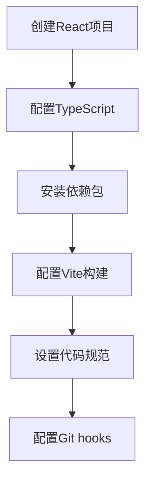
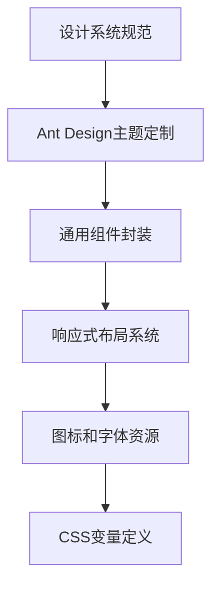
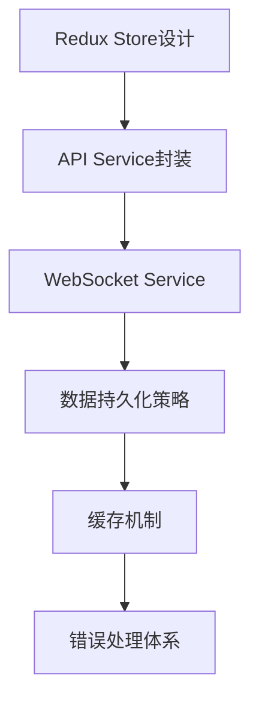
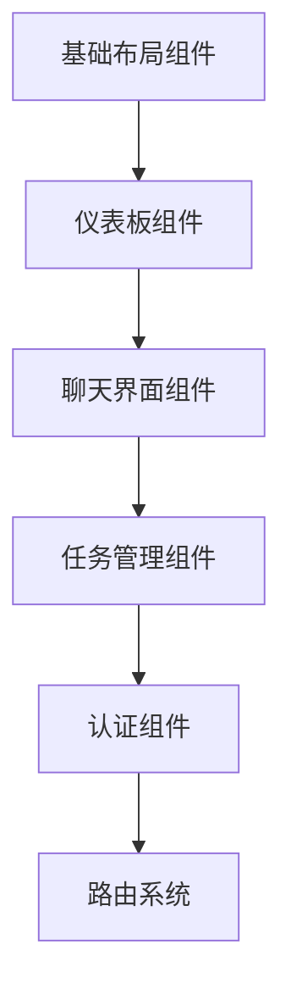

# 任务005：Web端核心界面 - 分析报告

## 1. 技术组件和架构分析

### 1.1 核心技术栈
- **前端框架**: React 18+ + TypeScript
- **UI组件库**: Ant Design 5.x (企业级设计语言，与后端技术栈一致)
- **状态管理**: Redux Toolkit + React Context API
- **实时通信**: WebSocket + Socket.IO Client
- **HTTP客户端**: Axios (与FastAPI后端集成)
- **构建工具**: Vite (快速热更新)
- **包管理**: npm/yarn

### 1.2 架构模式
- **组件化架构**: 采用功能模块化的组件设计
- **微前端准备**: 按功能域划分组件模块
- **响应式设计**: 支持桌面端为主，移动端适配
- **状态管理分层**: 全局状态(Redux) + 组件状态(Context) + 本地状态

### 1.3 关键技术组件

#### 1.3.1 基础仪表板组件
- **系统状态面板**: 展示健康检查、性能指标
- **Agent状态监控**: 实时显示Agent运行状态
- **任务概览组件**: 任务队列、执行状态、进度条
- **实时指标图表**: CPU、内存、网络使用率

#### 1.3.2 Agent聊天界面组件
- **消息列表组件**: 消息历史、时间戳、状态显示
- **消息输入组件**: 富文本输入、文件上传支持
- **Agent选择器**: 多Agent切换、状态指示
- **实时消息流**: WebSocket实时更新

#### 1.3.3 任务管理界面组件
- **任务列表组件**: 状态筛选、分页、搜索
- **任务详情组件**: 执行日志、资源使用、时间线
- **任务创建组件**: Agent选择、参数配置、优先级设置
- **任务监控组件**: 实时进度、日志流、性能图表

#### 1.3.4 通信基础设施
- **WebSocket客户端**: 实时双向通信
- **消息队列处理器**: 消息路由、状态同步
- **重连机制**: 自动重连、心跳检测
- **错误处理**: 优雅降级、用户友好提示

## 2. 执行流分析（并行流）

### 2.1 并行开发策略

#### 流程1: 项目脚手架和基础架构


#### 流程2: UI组件库和设计系统


#### 流程3: 状态管理和数据层


#### 流程4: 核心功能组件开发


### 2.2 依赖关系分析
- **流程1依赖**: 无外部依赖，可独立启动
- **流程2依赖**: 依赖流程1的基础项目结构
- **流程3依赖**: 依赖流程1的项目配置
- **流程4依赖**: 依赖流程2的UI系统和流程3的数据层

### 2.3 集成策略
- **阶段1**: 流程1和流程2并行开发，建立基础架构
- **阶段2**: 流程3开发，建立数据通信层
- **阶段3**: 流程4基于前三层开发核心功能
- **阶段4**: 全面集成测试和优化

## 3. 文件结构和依赖

### 3.1 前端项目结构
```
frontend/
├── public/
│   ├── index.html
│   ├── favicon.ico
│   └── assets/
├── src/
│   ├── components/
│   │   ├── common/           # 通用组件
│   │   │   ├── Layout/
│   │   │   ├── Loading/
│   │   │   ├── ErrorBoundary/
│   │   │   └── Notification/
│   │   ├── dashboard/        # 仪表板组件
│   │   │   ├── SystemStatus/
│   │   │   ├── AgentMonitor/
│   │   │   ├── TaskOverview/
│   │   │   └── MetricsChart/
│   │   ├── chat/            # 聊天界面组件
│   │   │   ├── MessageList/
│   │   │   ├── MessageInput/
│   │   │   ├── AgentSelector/
│   │   │   └── ChatContainer/
│   │   ├── tasks/           # 任务管理组件
│   │   │   ├── TaskList/
│   │   │   ├── TaskDetail/
│   │   │   ├── TaskCreate/
│   │   │   └── TaskMonitor/
│   │   └── auth/            # 认证组件
│   │       ├── Login/
│   │       ├── Register/
│   │       └── ProtectedRoute/
│   ├── pages/               # 页面组件
│   │   ├── Dashboard/
│   │   ├── Chat/
│   │   ├── Tasks/
│   │   ├── Settings/
│   │   └── NotFound/
│   ├── store/              # Redux状态管理
│   │   ├── slices/
│   │   │   ├── authSlice.ts
│   │   │   ├── agentSlice.ts
│   │   │   ├── taskSlice.ts
│   │   │   ├── messageSlice.ts
│   │   │   └── systemSlice.ts
│   │   ├── store.ts
│   │   └── middleware/
│   ├── services/           # API服务
│   │   ├── api.ts          # 基础API配置
│   │   ├── authService.ts
│   │   ├── agentService.ts
│   │   ├── taskService.ts
│   │   ├── messageService.ts
│   │   └── websocketService.ts
│   ├── hooks/              # 自定义Hooks
│   │   ├── useAuth.ts
│   │   ├── useAgents.ts
│   │   ├── useTasks.ts
│   │   ├── useMessages.ts
│   │   └── useWebSocket.ts
│   ├── utils/              # 工具函数
│   │   ├── helpers.ts
│   │   ├── validators.ts
│   │   ├── formatters.ts
│   │   └── constants.ts
│   ├── types/              # TypeScript类型定义
│   │   ├── api.ts
│   │   ├── components.ts
│   │   └── store.ts
│   ├── styles/             # 样式文件
│   │   ├── global.css
│   │   ├── variables.css
│   │   └── themes/
│   ├── assets/             # 静态资源
│   │   ├── images/
│   │   └── icons/
│   ├── App.tsx
│   ├── main.tsx
│   └── vite-env.d.ts
├── package.json
├── vite.config.ts
├── tsconfig.json
├── tailwind.config.js
└── .env
```

### 3.2 关键依赖包
```json
{
  "dependencies": {
    "react": "^18.2.0",
    "react-dom": "^18.2.0",
    "react-router-dom": "^6.8.0",
    "@reduxjs/toolkit": "^1.9.0",
    "react-redux": "^8.0.0",
    "antd": "^5.11.0",
    "@ant-design/icons": "^5.0.0",
    "axios": "^1.6.0",
    "socket.io-client": "^4.7.0",
    "recharts": "^2.8.0",
    "dayjs": "^1.11.0",
    "lodash": "^4.17.0",
    "react-query": "^3.39.0",
    "react-hook-form": "^7.48.0",
    "zod": "^3.22.0"
  },
  "devDependencies": {
    "@types/react": "^18.2.0",
    "@types/react-dom": "^18.2.0",
    "@types/node": "^20.0.0",
    "@types/lodash": "^4.14.0",
    "@typescript-eslint/eslint-plugin": "^6.0.0",
    "@typescript-eslint/parser": "^6.0.0",
    "@vitejs/plugin-react": "^4.0.0",
    "eslint": "^8.0.0",
    "eslint-plugin-react": "^7.33.0",
    "eslint-plugin-react-hooks": "^4.6.0",
    "prettier": "^3.0.0",
    "typescript": "^5.0.0",
    "vite": "^4.5.0",
    "vitest": "^0.34.0",
    "@testing-library/react": "^13.4.0",
    "@testing-library/jest-dom": "^6.1.0"
  }
}
```

### 3.3 与后端API的接口映射
- **用户认证**: `/api/v1/users/*`
- **Agent管理**: `/api/v1/agents/*`
- **任务管理**: `/api/v1/tasks/*`
- **消息通信**: `/api/v1/messages/*`
- **上下文管理**: `/api/v1/contexts/*`
- **向量搜索**: `/api/v1/vector/*`
- **任务执行**: `/api/v1/executor/*`
- **系统监控**: `/health/*`, `/metrics`

## 4. 风险和评估

### 4.1 技术风险
- **WebSocket连接稳定性**: 网络中断、重连机制
- **状态同步复杂性**: 多组件状态一致性
- **性能优化**: 大量消息的渲染性能
- **浏览器兼容性**: 现代浏览器功能支持

### 4.2 集成风险
- **API变更**: 后端接口调整的影响
- **数据格式**: 前后端数据结构不一致
- **认证机制**: JWT token管理、权限控制
- **CORS配置**: 跨域请求处理

### 4.3 开发风险
- **学习曲线**: 新技术栈的熟悉时间
- **代码质量**: 组件复用、代码规范
- **测试覆盖**: 单元测试、集成测试缺失
- **文档完整**: API文档、组件文档

### 4.4 风险缓解策略
- **渐进式开发**: 从基础功能开始，逐步扩展
- **模拟数据**: 开发阶段使用Mock API
- **类型安全**: 充分利用TypeScript类型检查
- **监控机制**: 错误边界、性能监控

## 5. 建议执行策略

### 5.1 开发阶段划分

#### 阶段1: 基础架构搭建 (1-2周)
- 创建React项目脚手架
- 配置TypeScript和Vite
- 安装和配置依赖包
- 设置代码规范和Git hooks
- 建立基础项目结构

#### 阶段2: UI系统和设计 (1-2周)
- 设计系统规范定义
- Ant Design主题定制
- 通用组件开发
- 响应式布局实现
- 基础样式系统

#### 阶段3: 数据通信层 (1周)
- API Service封装
- WebSocket Service实现
- Redux Store设计
- 状态管理中间件
- 错误处理机制

#### 阶段4: 核心功能组件 (2-3周)
- 仪表板组件开发
- 聊天界面组件开发
- 任务管理组件开发
- 路由系统配置
- 认证组件集成

#### 阶段5: 集成测试和优化 (1-2周)
- 端到端功能测试
- 性能优化
- 用户体验改进
- 文档完善
- 部署准备

### 5.2 质量检查点和验证标准

#### 5.2.1 代码质量检查
- **代码规范**: ESLint + Prettier
- **类型安全**: TypeScript严格模式
- **测试覆盖**: 80%以上代码覆盖率
- **性能指标**: Lighthouse评分90+
- **安全检查**: 无已知安全漏洞

#### 5.2.2 功能验证标准
- **响应式设计**: 支持主流屏幕尺寸
- **实时通信**: WebSocket连接稳定性
- **数据同步**: 状态一致性保证
- **用户体验**: 加载速度、交互流畅性
- **兼容性**: 支持Chrome、Firefox、Safari、Edge

#### 5.2.3 集成测试标准
- **API集成**: 所有后端接口正常调用
- **WebSocket通信**: 实时消息传输正常
- **状态管理**: Redux状态正确更新
- **错误处理**: 异常情况优雅处理
- **性能测试**: 高负载下稳定性

### 5.3 代理执行建议
- **前端架构师**: 负责整体架构设计和技术选型
- **UI组件开发者**: 负责设计系统和通用组件
- **功能组件开发者**: 负责核心功能模块
- **测试工程师**: 负责测试策略和质量保证
- **DevOps工程师**: 负责构建部署流程

### 5.4 并行开发建议
- **组件独立开发**: 按功能模块分配开发任务
- **接口先行**: 先定义API接口，再实现组件
- **Mock数据**: 使用Mock API进行并行开发
- **代码评审**: 建立代码评审机制
- **持续集成**: 设置自动化构建和测试流程

## 6. 成功指标

### 6.1 技术指标
- [ ] 所有验收标准100%完成
- [ ] 代码测试覆盖率≥80%
- [ ] 页面加载时间≤2秒
- [ ] WebSocket连接稳定性≥99%
- [ ] 无严重安全漏洞

### 6.2 用户体验指标
- [ ] 功能完整性测试通过
- [ ] 用户体验测试通过
- [ ] 跨浏览器兼容性测试通过
- [ ] 响应式设计验证通过
- [ ] 无障碍访问测试通过

### 6.3 项目管理指标
- [ ] 开发进度符合预期
- [ ] 代码质量符合标准
- [ ] 文档完整性达标
- [ ] 团队协作顺畅
- [ ] 风险控制有效

## 7. 后续规划

### 7.1 扩展功能
- **高级仪表板**: 更复杂的图表和指标
- **Agent管理界面**: Agent配置和监控
- **高级任务管理**: 任务调度和依赖管理
- **通知系统**: 邮件、短信通知
- **数据分析**: 用户行为分析、系统性能分析

### 7.2 性能优化
- **代码分割**: 按需加载组件
- **缓存策略**: 智能缓存机制
- **虚拟化**: 长列表虚拟滚动
- **图片优化**: 懒加载和压缩
- **CDN加速**: 静态资源分发

### 7.3 运维准备
- **监控系统**: 性能监控和告警
- **日志系统**: 前端日志收集
- **错误追踪**: 错误报告和分析
- **A/B测试**: 功能测试和优化
- **灰度发布**: 渐进式发布策略

---

**分析完成时间**: 2025-09-17
**预计开始时间**: 依赖任务001-003完成后
**预计完成时间**: 7-9周
**建议团队规模**: 3-5人