# Claude Code PM


[](https://github.com/automazeio/ccpm/blob/main/README.md)
 
[](https://github.com/automazeio/ccpm/blob/main/LICENSE)
 


### 使用规范驱动开发、GitHub issues、Git worktrees 和并行运行的多个 AI 代理，更好地交付代码的 Claude Code 工作流。

不再丢失上下文。不再任务阻塞。不再交付错误。这个经过实战检验的系统将 PRD 转化为史诗，史诗转化为 GitHub issues，issues 转化为生产代码——每一步都有完整的可追溯性。


## 目录

- [背景](#背景)
- [工作流程](#工作流程)
- [与众不同之处](#与众不同之处)
- [为什么选择 GitHub Issues？](#为什么选择-github-issues)
- [核心原则：杜绝随意编码](#核心原则杜绝随意编码)
- [系统架构](#系统架构)
- [工作流程阶段](#工作流程阶段)
- [命令参考](#命令参考)
- [并行执行系统](#并行执行系统)
- [主要特性与优势](#主要特性与优势)
- [验证成果](#验证成果)
- [示例流程](#示例流程)
- [立即开始](#立即开始)
- [本地与远程](#本地与远程)
- [技术说明](#技术说明)
- [支持此项目](#支持此项目)

## 背景

每个团队都面临着相同的挑战：
- **上下文断层**：会话结束后信息丢失，需要反复重新理解
- **并行冲突**：多名开发者同时修改同一代码产生冲突
- **需求偏离**：口头决策取代书面规范，导致目标模糊
- **进度黑盒**：直到项目后期才能看到实际进展

本系统完美解决以上所有问题。

## 工作流程

```mermaid
graph LR
    A[PRD 创建] --> B[史诗规划]
    B --> C[任务分解]
    C --> D[GitHub 同步]
    D --> E[并行执行]
```



### 一分钟体验

```bash
# 通过引导式头脑风暴创建完整的产品需求文档
/pm:prd-new memory-system

# 将产品需求转化为技术实施计划
/pm:prd-parse memory-system

# 推送到 GitHub 并启动并行开发
/pm:epic-oneshot memory-system
/pm:issue-start 1235
```

## 核心优势

| 传统开发模式 | Claude Code PM 系统 |
|------------|-------------------|
| 会话间上下文丢失 | **全流程上下文持久化** |
| 任务串行执行 | **多代理并行处理**独立任务 |
| 凭感觉编码 | **规范驱动**，全程可追溯 |
| 进度藏在分支里 | **GitHub 中透明审计** |
| 手动协调任务 | **智能优先级调度**使用 `/pm:next` |

## 为何选择 GitHub Issues？

大多数 Claude Code 工作流程都是孤立运行的——单个开发者在本地环境中与 AI 协作。这造成了一个根本问题：**AI 辅助开发变成了孤岛**。

以 GitHub Issues 为数据基础，我们获得了强大能力：

### 🤝 **真正的团队协作**
- 多个 Claude 实例可同时协作同一项目
- 开发者通过 issue 评论实时掌握 AI 进展
- 团队成员随时介入，上下文完全可见
- 管理者获得透明度，不打断开发节奏

### 🔄 **人机无缝交接**
- AI 启动任务，人类完成（或反之）
- 进度更新全员可见，不被聊天日志淹没
- 代码审查通过 PR 评论自然进行
- 告别"AI 干了啥？"的冗长会议

### 📈 **突破单人开发瓶颈**
- 加入团队成员，无需复杂培训
- 多个 AI 代理并行处理不同任务
- 分布式团队自动保持同步
- 原生支持现有 GitHub 工作流

### 🎯 **唯一权威数据源**
- 无需独立数据库或项目管理工具
- Issue 状态即项目状态
- 评论构成完整审计日志
- 标签提供灵活组织方式

这不仅是一个项目管理系统——更是一个**协作协议**，让人类与 AI 代理在团队已信任的基础设施上实现规模化协作。

## 核心理念：告别随意编码

> **每行代码都必须有据可依。**

我们严守五阶段工作法：

1. **🧠 头脑风暴** - 思考得更深入
2. **📝 精准文档** - 编写无歧义的明确规范
3. **📐 技术规划** - 制定清晰的技术决策架构
4. **⚡ 精确实施** - 严格按规范构建
5. **📊 全程追踪** - 每一步都保持透明进展

不走捷径。不做假设。不留遗憾。

## 系统架构

```
.claude/
├── CLAUDE.md          # 始终生效的指令（将内容复制到项目的 CLAUDE.md 文件）
├── agents/            # 面向任务的代理（用于上下文保持）
├── commands/          # 命令定义
│   ├── context/       # 创建、更新和加载上下文
│   ├── pm/            # ← 项目管理命令（本系统）
│   └── testing/       # 准备和执行测试（编辑此部分）
├── context/           # 项目范围的上下文文件
├── epics/             # ← PM 的本地工作空间（放入 .gitignore）
│   └── [epic-name]/   # 史诗和相关任务
│       ├── epic.md    # 实施计划
│       ├── [#].md     # 单个任务文件
│       └── updates/   # 进行中的更新
├── prds/              # ← PM 的 PRD 文件
├── rules/             # 在此放置您想要引用的任何规则文件
└── scripts/           # 在此放置您想要使用的任何脚本文件
```

## 工作流程阶段

### 1. 产品规划阶段

```bash
/pm:prd-new feature-name
```
启动全面的头脑风暴，创建包含愿景、用户故事、成功标准和约束的产品需求文档。

**输出：** `.claude/prds/feature-name.md`

### 2. 实施规划阶段

```bash
/pm:prd-parse feature-name
```
将 PRD 转换为包含架构决策、技术方法和依赖映射的技术实施计划。

**输出：** `.claude/epics/feature-name/epic.md`

### 3. 任务分解阶段

```bash
/pm:epic-decompose feature-name
```
将史诗分解为具体的、可操作的任务，包含验收标准、工作量估算和并行化标志。

**输出：** `.claude/epics/feature-name/[task].md`

### 4. GitHub 同步

```bash
/pm:epic-sync feature-name
# 或对于自信的工作流程：
/pm:epic-oneshot feature-name
```
将史诗和任务作为带有适当标签和关系的 issues 推送到 GitHub。

### 5. 执行阶段

```bash
/pm:issue-start 1234  # 启动专用代理
/pm:issue-sync 1234   # 推送进度更新
/pm:next             # 获取下一个优先级任务
```
专用代理实施任务，同时保持进度更新和审计跟踪。

## 命令参考

> 输入 `/pm:help` 获取简洁的命令摘要

### 初始设置
- `/pm:init` - 安装依赖并配置 GitHub

### PRD 命令
- `/pm:prd-new` - 为新产品需求启动头脑风暴
- `/pm:prd-parse` - 将 PRD 转换为实施史诗
- `/pm:prd-list` - 列出所有 PRD
- `/pm:prd-edit` - 编辑现有 PRD
- `/pm:prd-status` - 显示 PRD 实施状态

### 史诗命令
- `/pm:epic-decompose` - 将史诗分解为任务文件
- `/pm:epic-sync` - 将史诗和任务推送到 GitHub
- `/pm:epic-oneshot` - 在一个命令中分解和同步
- `/pm:epic-list` - 列出所有史诗
- `/pm:epic-show` - 显示史诗及其任务
- `/pm:epic-close` - 将史诗标记为完成
- `/pm:epic-edit` - 编辑史诗详情
- `/pm:epic-refresh` - 从任务更新史诗进度

### Issue 命令
- `/pm:issue-show` - 显示 issue 和子 issue
- `/pm:issue-status` - 检查 issue 状态
- `/pm:issue-start` - 使用专用代理开始工作
- `/pm:issue-sync` - 将更新推送到 GitHub
- `/pm:issue-close` - 将 issue 标记为完成
- `/pm:issue-reopen` - 重新打开已关闭的 issue
- `/pm:issue-edit` - 编辑 issue 详情

### 工作流程命令
- `/pm:next` - 显示带有史诗上下文的下一个优先级 issue
- `/pm:status` - 整体项目仪表板
- `/pm:standup` - 每日站会报告
- `/pm:blocked` - 显示被阻塞的任务
- `/pm:in-progress` - 列出进行中的工作

### 同步命令
- `/pm:sync` - 与 GitHub 完全双向同步
- `/pm:import` - 导入现有 GitHub issues

### 维护命令
- `/pm:validate` - 检查系统完整性
- `/pm:clean` - 归档已完成的工作
- `/pm:search` - 在所有内容中搜索

## 并行执行系统

### Issues 不是原子的

传统思维：一个 issue = 一个开发者 = 一个任务

**现实：一个 issue = 多个并行工作流**

单个"实现用户身份验证" issue 不是一个任务。它包含...

- **代理 1**：数据库表和迁移
- **代理 2**：服务层和业务逻辑
- **代理 3**：API 端点和中间件
- **代理 4**：UI 组件和表单
- **代理 5**：测试套件和文档

所有都在**同一工作树中同时运行**。

### 速度的数学

**传统方法：**
- 包含 3 个 issues 的史诗
- 串行执行

**本系统：**
- 相同的史诗，3 个 issues
- 每个 issue 分解为约 4 个并行流
- **12 个代理同时工作**

我们不是将代理分配给 issues。我们是**利用多个代理**来更快地交付。

### 上下文优化

**传统的单线程方法：**
- 主对话承载所有实施细节
- 上下文窗口充满数据库架构、API 代码、UI 组件
- 最终达到上下文限制并失去连贯性

**并行代理方法：**
- 主线程保持干净和战略性
- 每个代理独立处理自己的上下文
- 实施细节永远不会污染主对话
- 主线程保持监督而不会被代码淹没

您的主对话成为指挥家，而不是整个乐队。

### GitHub 与本地：完美分离

**GitHub 看到的：**
- 干净、简单的 issues
- 进度更新
- 完成状态

**本地实际发生的：**
- Issue #1234 爆炸成 5 个并行代理
- 代理通过 Git 提交进行协调
- 复杂的编排被隐藏

GitHub 不需要知道工作是如何完成的——只需要知道它完成了。

### 命令流程

```bash
# 分析可以并行化的内容
/pm:issue-analyze 1234

# 启动群体
/pm:epic-start memory-system

# 观看魔法
# 12 个代理在 3 个 issues 上工作
# 全部在：../epic-memory-system/

# 完成时一次干净合并
/pm:epic-merge memory-system
```

## 主要特性与优势

### 🧠 **上下文保持**
不再丢失项目状态。每个史诗维护自己的上下文，代理从 `.claude/context/` 读取，在同步之前进行本地更新。

### ⚡ **并行执行**
通过多个代理同时工作来更快地交付。标记为 `parallel: true` 的任务实现无冲突的并发开发。

### 🔗 **GitHub 原生**
与您的团队已经使用的工具一起工作。Issues 是真实来源，评论提供历史记录，不依赖于 Projects API。

### 🤖 **代理专业化**
为每项工作提供合适的工具。UI、API 和数据库工作的不同代理。每个代理自动读取需求和发布更新。

### 📊 **完全可追溯性**
每个决策都被记录。PRD → 史诗 → 任务 → Issue → 代码 → 提交。从想法到生产的完整审计跟踪。

### 🚀 **开发者生产力**
专注于构建，而不是管理。智能优先级排序、自动上下文加载，以及在准备就绪时进行增量同步。

## 验证成果

使用此系统的团队报告：
- **89% 更少的时间**因上下文切换而损失——您会更少地使用 `/compact` 和 `/clear`
- **5-8 个并行任务**对比之前的 1 个——同时编辑/测试多个文件
- **75% 的错误率降低**——由于将功能分解为详细任务
- **最多快 3 倍**的功能交付——基于功能大小和复杂性

## 示例流程

```bash
# 开始新功能
/pm:prd-new memory-system

# 审查和完善 PRD...

# 创建实施计划
/pm:prd-parse memory-system

# 审查史诗...

# 分解为任务并推送到 GitHub
/pm:epic-oneshot memory-system
# 创建 issues：#1234（史诗）、#1235、#1236（任务）

# 开始任务开发
/pm:issue-start 1235
# 代理开始工作，维护本地进度

# 同步进度到 GitHub
/pm:issue-sync 1235
# 更新作为 issue 评论发布

# 检查整体状态
/pm:epic-show memory-system
```

## 立即开始

### 快速设置（2 分钟）

1. **将此存储库安装到您的项目中**：

   #### Unix/Linux/macOS

   ```bash
   cd path/to/your/project/
   curl -sSL https://raw.githubusercontent.com/automazeio/ccpm/main/ccpm.sh | bash
   # 或者：wget -qO- https://raw.githubusercontent.com/automazeio/ccpm/main/ccpm.sh | bash
   ```

   #### Windows (PowerShell)
   ```bash
   cd path/to/your/project/
   iwr -useb https://raw.githubusercontent.com/automazeio/ccpm/main/ccpm.bat | iex
   ```
   > ⚠️ **重要**：如果您已经有 `.claude` 目录，请将此存储库克隆到不同的目录，并将克隆的 `.claude` 目录的内容复制到您项目的 `.claude` 目录中。

   在[安装指南 ›](https://github.com/automazeio/ccpm/tree/main/install) 中查看完整/其他安装选项


2. **初始化 PM 系统**：
   ```bash
   /pm:init
   ```
   此命令将：
   - 安装 GitHub CLI（如果需要）
   - 使用 GitHub 进行身份验证
   - 安装 [gh-sub-issue 扩展](https://github.com/yahsan2/gh-sub-issue) 以实现正确的父子关系
   - 创建所需的目录
   - 更新 .gitignore

3. **创建 `CLAUDE.md`** 包含您的存储库信息
   ```bash
   /init include rules from .claude/CLAUDE.md
   ```
   > 如果您已经有 `CLAUDE.md` 文件，请运行：`/re-init` 以使用 `.claude/CLAUDE.md` 中的重要规则更新它。

4. **准备系统**：
   ```bash
   /context:create
   ```


### 开始您的第一个功能

```bash
/pm:prd-new your-feature-name
```

观看结构化规划如何转变为交付的代码。

## 本地与远程

| 操作 | 本地 | GitHub |
|-----------|-------|--------|
| PRD 创建 | ✅ | — |
| 实施规划 | ✅ | — |
| 任务分解 | ✅ | ✅ (同步) |
| 执行 | ✅ | — |
| 状态更新 | ✅ | ✅ (同步) |
| 最终交付物 | — | ✅ |

## 技术说明

### GitHub 集成
- 使用 **gh-sub-issue 扩展** 实现正确的父子关系
- 如果未安装扩展，则回退到任务列表
- 史诗 issues 自动跟踪子任务完成情况
- 标签提供额外的组织结构（`epic:feature`、`task:feature`）

### 文件命名约定
- 任务在分解期间以 `001.md`、`002.md` 开始
- GitHub 同步后，重命名为 `{issue-id}.md`（例如 `1234.md`）
- 使导航变得容易：issue #1234 = 文件 `1234.md`

### 设计决策
- 故意避免 GitHub Projects API 的复杂性
- 所有命令首先在本地文件上操作以提高速度
- 与 GitHub 的同步是明确和受控的
- Worktrees 为并行工作提供干净的 git 隔离
- 可以单独添加 GitHub Projects 用于可视化

---

## 支持此项目

Claude Code PM 由 [Automaze](https://automaze.io) 开发，**为交付软件的开发者，由交付软件的开发者而开发**。

如果 Claude Code PM 帮助您的团队更好地交付软件：

- ⭐ **[Star this repository](https://github.com/automazeio/ccpm)** 表示您的支持
- 🐦 **[在 X 上关注 @aroussi](https://x.com/aroussi)** 获取更新和技巧


---

> [!TIP]
> **通过 Automaze 更快地交付。** 我们与创始人合作，将他们的愿景变为现实，扩展他们的业务，并为成功进行优化。
> **[访问 Automaze 与我预约通话 ›](https://automaze.io)**

---

## Star 历史


